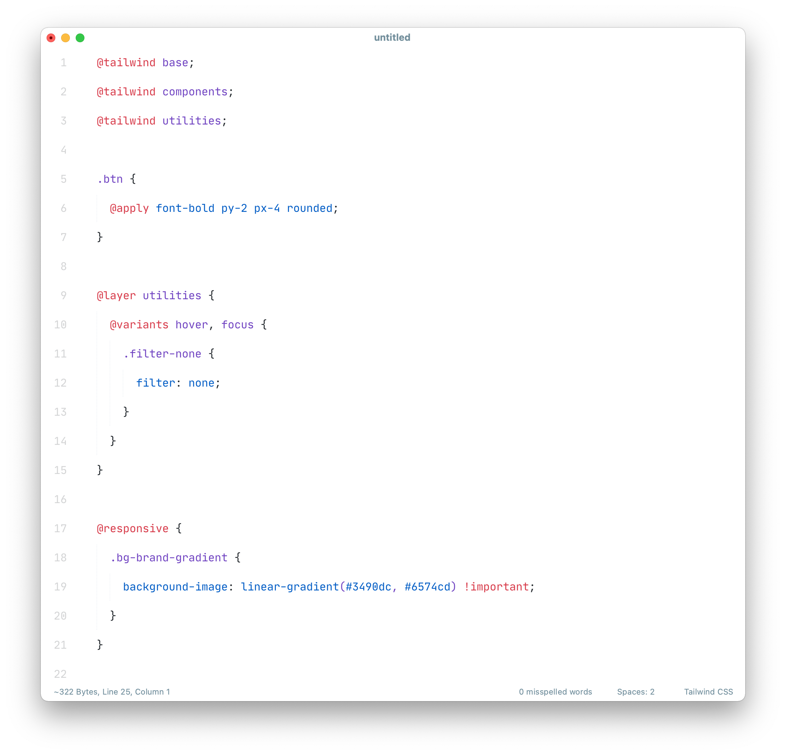

# Tailwind CSS

A [Sublime Text](http://www.sublimetext.com) CSS syntax extension with support for [Tailwind CSS](https://tailwindcss.com/)

_Requires ST 4094 or higher._

## Install

**Package Control:**

1. Open `Command Palette` using menu item `Tools → Command Palette` or `CMD/CTRL` + `SHIFT` +`P`.
2. Choose `Package Control: Install Package`.
3. Type `Tailwind CSS` and press `ENTER`.

**Manually:**

1. Download latest release and unzip. it into your Packages folder.
2. Go to `Sublime Text → Preferences → Browse Packages`.
3. Move folder to inside and rename the folder to `Tailwind CSS`.

## Usage

This syntax is assigned to files which end with `tailwind.css` by default.

You need to assign it to ordinary `*.css` files manually.

1. Click onto the syntax name in the status bar
2. Navigate to the sub menu `Open all with current extension as...`
3. Click on `Tailwind CSS`.

## Related Extensions

- [LSP-tailwindcss](https://github.com/sublimelsp/LSP-tailwindcss)
